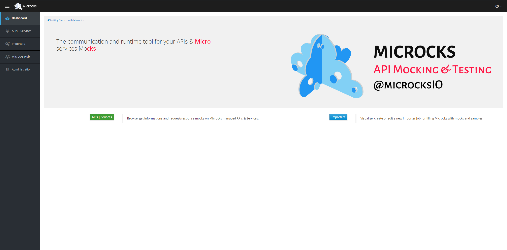
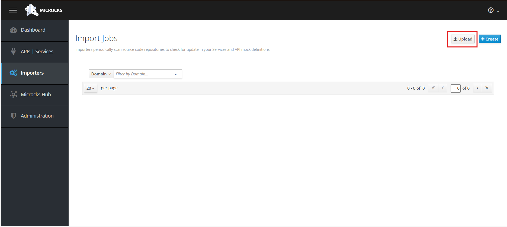
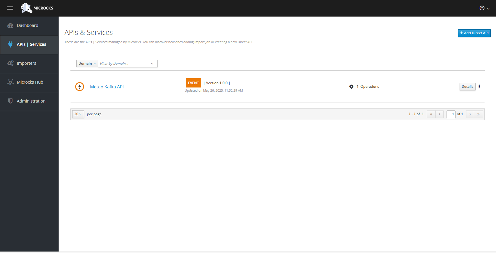
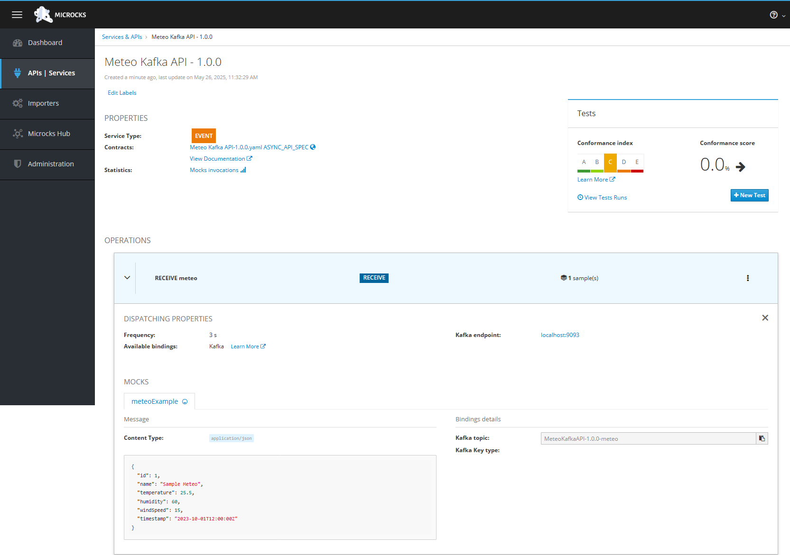
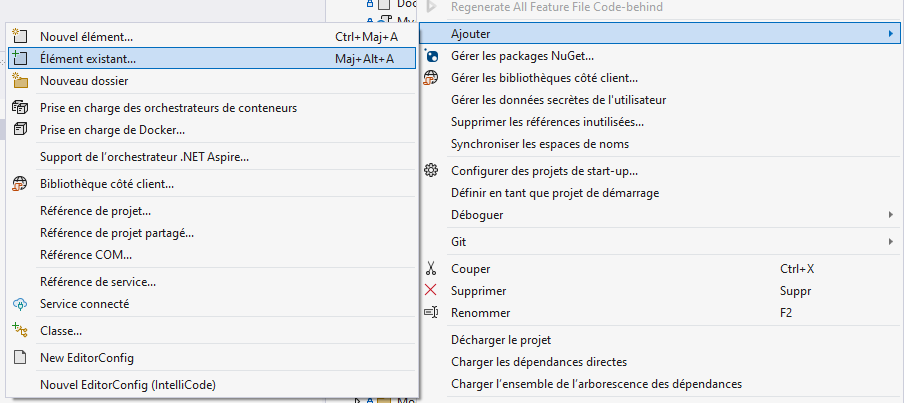
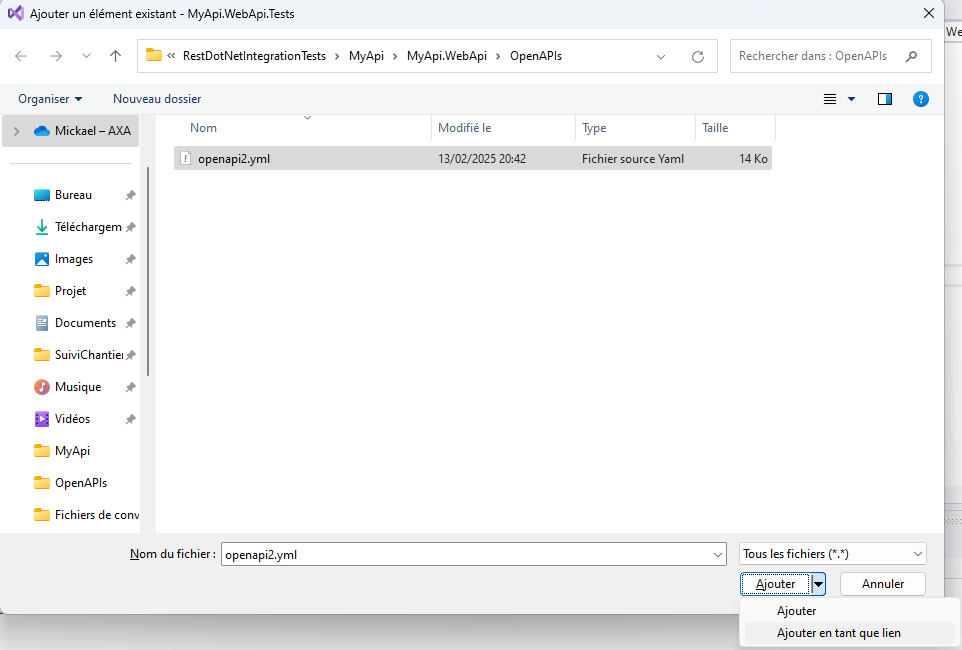
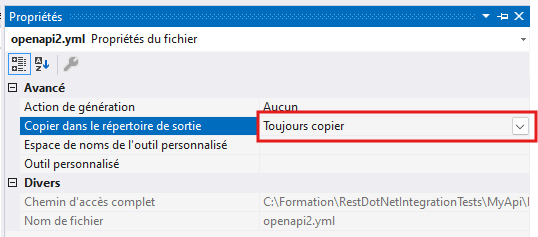

# Module 4: Test du service Kafka avec Microcks

## Qu'allons-nous faire?

Nous allons intégrer notre solution de lecture Kafka avec Microcks dans l'usage de notre application puis par la suite dans notre test.

## Instructions

Dans un premier temps, nous allons ajouter 2 fichiers de configuration pour notre docker / podman, ces 2 fichiers seront lus par Microcks pour démarrer le processus de mock des Async API (Queue, Kafka, etc...)

## C'est quoi concrétement Microcks ?

Microcks démarre un serveur pour fournir un environnement dans lequel les APIs simulées (mocks) peuvent être hébergées et accessibles. Cela peut être utilisé pour plusieurs raison :

1. **Accessibilité des Mocks** : En démarrant un serveur, Microcks permet aux développeurs d'accéder aux mocks d'API via des endpoints HTTP. Cela permet aux utilisateurs de tester leurs applications comme s'ils interagissaient avec une API réelle.

2. **Tests Locaux** : Un serveur local offre aux développeurs la possibilité de tester leurs applications sans dépendre d'une API externe, ce qui est particulièrement utile pour le développement local, les tests unitaires, et les tests d'intégration.

3. **Simulation du Comportement de l'API** : Le serveur peut simuler des comportements spécifiques de l'API, comme des réponses réussies, des erreurs ou des délais, permettant aux développeurs de vérifier comment leur application réagit dans différentes situations.

4. **Collaboration** : En ayant un serveur en cours d'exécution, les membres de l'équipe peuvent accéder aux mocks et les tester facilement. Cela facilite la collaboration entre les développeurs, les testeurs et les parties prenantes.

5. **Intégration dans des Pipelines CI/CD** : Dans le cadre d'un processus d'intégration continue et de déploiement continu (CI/CD), un serveur peut être utilisé pour effectuer des tests automatisés sur les mocks d'API, garantissant ainsi que les modifications apportées au code n'introduisent pas de régressions.

En résumé, le démarrage d'un serveur par Microcks permet de créer un environnement de test réaliste et accessible pour les développeurs, ce qui améliore l'efficacité du développement et la qualité des applications.

### Fichier de configuration

Nous devons créer 2 fichiers, le premier sera `features.properties`, placez le fichier dans le dossier : `MyApi/config/features.properties`

Le second sera `application.properties`, placez le au même endroit que le fichier précédent.

#### application.properties

```toml
# Async mocking support.
async-api.enabled=true

# Access to Microcks API server.
%docker-compose.io.github.microcks.minion.async.client.MicrocksAPIConnector/mp-rest/url=http://host.docker.internal:8585

# Access to Kafka broker.
%docker-compose.kafka.bootstrap.servers=kafka:9093

# Do not save any consumer-offset on the broker as there's a re-sync on each minion startup.
%docker-compose.mp.messaging.incoming.microcks-services-updates.enable.auto.commit=false
%docker-compose.mp.messaging.incoming.microcks-services-updates.bootstrap.servers=kafka:9093

# Explicitly telling the minion the protocols we want to support
%docker-compose.minion.supported-bindings=KAFKA,WS
```

La première étape consiste à activer le support des API asynchrones. Cela se fait par la ligne de configuration suivante :

`async-api.enabled=true`

Cette option permet au système de gérer des appels non bloquants, ce qui est crucial pour les performances et la réactivité des applications modernes.

Ensuite, nous devons configurer l'accès à l'API de Microcks. Cela se fait via la ligne :

`%docker-compose.io.github.microcks.minion.async.client.MicrocksAPIConnector/mp-rest/url=http://host.docker.internal:8585`

Cette configuration définit l'URL à laquelle les composants peuvent se connecter pour effectuer des opérations asynchrones avec le serveur API de Microcks.

Le serveur Kafka est un élément clé pour la gestion des messages dans notre architecture. Nous le spécifions avec la ligne suivante :

`%docker-compose.kafka.bootstrap.servers=kafka:9093`

Ici, kafka représente le nom d'hôte du serveur Kafka, et 9093 est le port sur lequel il écoute. Cela permet aux différents services de se connecter et d'échanger des messages.

Une autre configuration importante concerne la gestion des offsets des consommateurs. Nous utilisons la ligne suivante pour désactiver le commit automatique :

`%docker-compose.mp.messaging.incoming.microcks-services-updates.enable.auto.commit=false`

En désactivant cette fonctionnalité, nous permettons une re-synchronisation à chaque démarrage du minion, ce qui peut être utile dans certaines situations de gestion de l'état.

Pour les mises à jour des services Microcks, nous devons également spécifier le serveur Kafka :

`%docker-compose.mp.messaging.incoming.microcks-services-updates.bootstrap.servers=kafka:9093`

Cette ligne indique où se connecter pour recevoir les messages relatifs aux mises à jour, garantissant ainsi que le minion reste à jour avec les informations nécessaires.

Enfin, nous devons indiquer les protocoles que le minion supporte. Cela se fait avec la configuration suivante :

`%docker-compose.minion.supported-bindings=KAFKA,WS`

Cette ligne précise que le minion peut gérer les communications via Kafka et WebSocket (WS), ce qui élargit les possibilités d'interaction avec d'autres services.

#### features.properties\*

```toml
features.feature.async-api.enabled=true
features.feature.async-api.frequencies=3,10,30
features.feature.async-api.default-binding=KAFKA
features.feature.async-api.endpoint-KAFKA=localhost:9093
features.feature.async-api.endpoint-WS=localhost:8081
```

La première ligne de configuration active le support de l'API asynchrone :

`features.feature.async-api.enabled=true`

Cette option indique que les fonctionnalités asynchrones sont activées dans le système, permettant aux services de traiter des requêtes de manière non bloquante.

La ligne suivante définit les fréquences d'interrogation pour l'API asynchrone :

`features.feature.async-api.frequencies=3,10,30`

Ici, les valeurs 3, 10 et 30 peuvent représenter des intervalles en secondes entre les tentatives de connexion ou d'interrogation des services. Cela permet de régler la fréquence à laquelle les services asynchrones tentent de communiquer, optimisant ainsi les performances en évitant une surcharge inutile.

La configuration suivante spécifie le lien par défaut utilisé par l'API asynchrone :

`features.feature.async-api.default-binding=KAFKA`

Cette ligne indique que le protocole par défaut pour la communication asynchrone est Kafka. Cela signifie que, si aucune autre option n'est spécifiée, le système utilisera Kafka pour gérer les messages asynchrones.

La ligne suivante définit le point de terminaison pour Kafka :

`features.feature.async-api.endpoint-KAFKA=localhost:9093`

Ici, localhost:9093 représente l'adresse du serveur Kafka. Cela permet aux services de se connecter à Kafka pour envoyer et recevoir des messages asynchrones.

Enfin, nous avons la configuration pour le point de terminaison WebSocket :

`features.feature.async-api.endpoint-WS=localhost:8081`

Cette ligne définit l'adresse à laquelle les services peuvent se connecter pour utiliser le protocole WebSocket (WS). Le port 8081 est utilisé pour établir des connexions WebSocket, permettant une communication bidirectionnelle en temps réel entre les services.

Maintenant que vous avez confiuguré Microcks pour démarrer proprement la gestion des evenemments Async, créeons un fichier de type `AsyncApi`

### Fichier Async API

La convention `AsyncAPI` est une spécification qui vise à standardiser la documentation et la conception des APIs asynchrones, similaires à ce que fait OpenAPI pour les APIs REST. Elle permet aux développeurs de décrire les interactions entre les services dans un environnement basé sur des messages, comme les architectures orientées événements ou les systèmes basés sur des files d'attente.

Voici quelques points clés concernant `AsyncAPI` :

**Format de description** : `AsyncAPI` utilise un format YAML ou JSON pour décrire les différentes composantes d'une API asynchrone, incluant les canaux de communication, les messages échangés, et les événements générés.

**Support pour divers protocoles** : La spécification prend en charge divers protocoles de communication asynchrone comme MQTT, AMQP, WebSockets, et d'autres, permettant ainsi une grande flexibilité dans l'architecture des systèmes.

**Documentation et outils** : Comme `OpenAPI`, `AsyncAPI` permet de générer automatiquement de la documentation interactive, des SDK, et des tests, facilitant ainsi le développement et l'intégration des services.

**Interactions basées sur des événements** : Avec `AsyncAPI`, les développeurs peuvent mieux gérer les interactions basées sur des événements, en précisant comment les différents services s'écoutent et communiquent.

En résumé, `AsyncAPI` est une initiative précieuse pour les architectes et développeurs qui travaillent avec des systèmes asynchrones, leur permettant de mieux structurer et documenter leurs architectures basées sur des événements.

#### Création du fichier

Il est conseillé de créer le fichier à la racine du projet : `MyApi/meteoKafkaAsyncApi.yml`

```yaml
asyncapi: 3.0.0
info:
  title: Meteo Kafka API
  version: 1.0.0
  description: |-
    A sample API to demonstrate features  
    in the AsyncAPI 3.0 specification and Microcks
  contact:
    name: Microcks Team
    url: "https://microcks.io"
  license:
    name: Apache 2.0
    url: https://www.apache.org/licenses/LICENSE-2.0
defaultContentType: application/json
channels:
  meteoCreated:
    address: new-meteo-info
    description: Channel for new meteo information
    messages:
      meteoCreated:
        $ref: "#/components/messages/meteo"
operations:
  meteo:
    action: receive
    channel:
      $ref: "#/channels/meteoCreated"
    messages:
      - $ref: "#/channels/meteoCreated/messages/meteoCreated"
components:
  messages:
    meteo:
      payload:
        $ref: "#/components/schemas/Meteo"
      contentType: application/json
      examples:
        - name: meteoExample
          payload:
            id: 1
            name: "Sample Meteo"
            temperature: 25.5
            humidity: 60.0
            windSpeed: 15.0
            timestamp: "2023-10-01T12:00:00Z"
  schemas:
    Meteo:
      type: object
      properties:
        id:
          type: integer
          description: Unique identifier for the meteo information
        name:
          type: string
          description: Name of the meteo information
          temperature:
            type: number
            format: float
            description: Temperature in Celsius degrees
          humidity:
            type: number
            format: float
            description: Humidity percentage
          windSpeed:
            type: number
            format: float
            description: Wind speed in km/h
        timestamp:
          type: string
          format: date-time
          description: Timestamp of the meteo information in ISO 8601 format
```

Bien maintenant que nous avons notre fichier & Microcks de configuré, nous allons injecter ce fichier dans microcks pour ce faire, allez sur [http://localhost:8585](http://localhost:8585)

Vous devriez arrivé sur cette page :



#### Injection du fichier dans Microcks

Cliquer sur `Importers` et cliquer sur `upload`, prenez le fichier `AsyncAPI` que nous venons de créer.



Allez ensuite dans `API | Services`, vous devriez voir votre api custom.



Rentrer dedans et vous devriez voir 1 définition d'appel dans les opérations.



Maitenant allons sur [Kafdrop](http://localhost:9000), vous devriez voir un nouveau topic nommé `MeteoKafkaAPI-1.0.0-meteo`

Allez voir les messages de ce topic comme effectué durant le premier module, si vous avez une page vide recliquez sur `View Message` pour raffraichir Kafdrop.

Vous devriez voir un certain nombre de fois le message suivant :

```json
{
  "id": 1,
  "name": "Sample Meteo",
  "temperature": 25.5,
  "humidity": 60.0,
  "windSpeed": 15.0,
  "timestamp": "2023-10-01T12:00:00Z"
}
```

Maintenant que notre Kafka & Microcks fonctionne ensemble et que l'on reçoit un certains nombre de message, modifions notre code applicatif pour se connecter au bon topic.

### Code Applicatif

Dans un premier temps, nous allons modifier le fichier `MyApi/MyApi.WebApi/Kafka/MeteoConsumerBackgroundService.cs` pour recevoir un nouveau paramètre dans le constructeur qui sera le topic à consommer.

#### Background service

```diff
using Microsoft.Extensions.DependencyInjection;
using MyApi.WebApi.Kafka;

public class MeteoConsumerBackgroundService : BackgroundService
{
    private readonly IMeteoConsumer _kafkaConsumer;
    private readonly IMeteoHandler _meteoHandler;
    private readonly IServiceScopeFactory _providerScopeFactory;
+    private readonly string _topic;

-    public MeteoConsumerBackgroundService(IMeteoConsumer kafkaConsumer, IMeteoHandler meteoHandler, IServiceScopeFactory serviceScopeFactory)
+    public MeteoConsumerBackgroundService(IMeteoConsumer kafkaConsumer, IMeteoHandler meteoHandler, IServiceScopeFactory serviceScopeFactory, string topic)
    {
        _kafkaConsumer = kafkaConsumer;
        _meteoHandler = meteoHandler;
        _providerScopeFactory = serviceScopeFactory;
+        _topic = topic;
    }

    protected override async Task ExecuteAsync(CancellationToken stoppingToken)
    {
-        _kafkaConsumer.Subscribe("meteo");
+        _kafkaConsumer.Subscribe(_topic);

        using var scope = _providerScopeFactory.CreateScope();
        try
        {
            while (!stoppingToken.IsCancellationRequested)
            {
                var consumeResult = await _kafkaConsumer.ConsumeAsync(stoppingToken);
                await _meteoHandler.ExecuteAsync(consumeResult);
            }
        }
        catch (OperationCanceledException)
        {
            // Arrêt du service
        }
        catch (Exception ex)
        {
            Console.WriteLine($"Erreur dans le service : {ex.Message}");
            throw;  // Relancer l'exception si elle n'est pas attendue
        }
    }
}
```

Ensuite nous devons modifier l'injection de dépendance dans le fichier `Program.cs` pour permettre au BackgroundService de récupérer le topic.

#### Program.cs

```diff
- builder.Services.AddHostedService<MeteoConsumerBackgroundService>();
+ builder.Services.AddHostedService(provider =>
+ {
+     var kafkaConsumer = provider.GetRequiredService<IMeteoConsumer>();
+     var serviceScopeFactory = provider.GetRequiredService<IServiceScopeFactory>();
+     var meteoHandler = provider.GetRequiredService<IMeteoHandler>();
+     return new MeteoConsumerBackgroundService(kafkaConsumer, meteoHandler, serviceScopeFactory,"MeteoKafkaAPI-1.0.0-meteo");
+ });
```

Si vous lancez l'application, vous devriez maintenant recevoir les messages Kafka venant de Microcks !

Et maintenant si on modifié nos tests pour utiliser Microcks et donc le fichier `AsyncApi` que nous avons créé.

### Modification des tests

Dans un premier temps, nous devons installer le package `Microcks.Testcontainers` pensez bien à prendre une version équivalente ou supérieur à `0.2.0`

Une fois installé, nous allons créer un dossier `Mocks` dans la solution de test soit `MyApi/MyApi.WebApi.Tests/Mocks`

Ajouter par la suite un nouveau fichier déjà existant, et choissisez l'option "Ajouter en tant que lien"





Une fois le fichier ajouter, modifier ses propriétés dans l'IDE et passé le en `Always Copy`



Bien maintenant nous devons modifier du code dans notre hook de démarrage et nos steps Gherkin pour valider le fonctionnement avec Microcks.

#### InitWebApplicationFactory.cs

Créeons une nouvelle fonction nommée `ReplaceKafkaMicrocks` qui s'occupera de créer un réseau, gérer la connexion entre le test container Kafka & Microcks.

```c#
private async static Task ReplaceKafkaMicrocks(ScenarioContext scenarioContext)
{
    var network = new NetworkBuilder().Build();

    await network.CreateAsync();
    var listener = "test-kafka:19092";

    var kafkaContainer = new KafkaBuilder()
            .WithImage("confluentinc/cp-kafka:7.0.0")
            .WithNetwork(network)
            .WithListener(listener)
            .WithNetworkAliases("test-kafka")
            .Build();

    await kafkaContainer.StartAsync();
    await Task.Delay(5000);

    if (!File.Exists("Mocks\\meteoKafkaAsyncApi.yml"))
    {
        throw new FileNotFoundException("L'artefact Microcks 'meteoKafkaAsyncApi.yml' est introuvable.");
    }

    MicrocksContainerEnsemble ensemble = new MicrocksContainerEnsemble(network, "quay.io/microcks/microcks-uber:1.11.0")
        .WithMainArtifacts("Mocks\\meteoKafkaAsyncApi.yml")
        .WithKafkaConnection(new KafkaConnection(listener));

    await ensemble.StartAsync();
    var topic = ensemble.AsyncMinionContainer.GetKafkaMockTopic("Meteo Kafka API", "1.0.0", "meteo");

    var bootstrapServers = kafkaContainer.GetBootstrapAddress();

    scenarioContext.TryAdd("KafkaBootstrapServers", bootstrapServers);
    scenarioContext.TryAdd("KafkaTopic", topic);
}
```

Ce code en C# configure et démarre une infrastructure de test pour une application interagissant avec Kafka. Voici un résumé des étapes clés :

1. **Création d'un réseau** : Un réseau Docker est créé pour isoler les conteneurs.
2. **Démarrage de Kafka** : Un conteneur Kafka est configuré (image, réseau, listener) et démarré, avec une pause de 5 secondes pour s'assurer qu'il est opérationnel.
3. **Vérification d'un fichier** : Le code vérifie la présence d'un fichier YAML essentiel ; une exception est levée s'il est introuvable.
4. **Configuration de Microcks** : Un ensemble de conteneurs Microcks est créé, utilisant le fichier YAML et une connexion à Kafka.
5. **Démarrage de Microcks** : L'ensemble de conteneurs Microcks est démarré.
6. **Récupération du topic Kafka** : Le code obtient un topic Kafka spécifique pour les tests.
7. **Ajout au contexte** : Les informations sur les serveurs bootstrap et le topic sont ajoutées à un contexte de scénario pour un accès ultérieur.

Remplaçons l'ancien code de génération des tests Containers:

```diff
-        var kafkaContainer = new KafkaBuilder()
-         .WithImage("confluentinc/cp-kafka:7.0.0")
-            .WithEnvironment("KAFKA_BROKER_ID", "1")
-            .WithEnvironment("KAFKA_ZOOKEEPER_CONNECT", "localhost:2181")
-            .WithEnvironment("KAFKA_ADVERTISED_LISTENERS", "PLAINTEXT://localhost:9092")
-            .WithEnvironment("KAFKA_OFFSETS_TOPIC_REPLICATION_FACTOR", "1")
-            .WithPortBinding(9092, 9092)
-            .WithWaitStrategy(Wait.ForUnixContainer().UntilPortIsAvailable(9092))
-            .Build();
-
-        await kafkaContainer.StartAsync();
-
-        scenarioContext.TryAdd("kafkaContainer", kafkaContainer);
-
-        var bootstrapServers = kafkaContainer.GetBootstrapAddress();
-        scenarioContext["KafkaBootstrapServers"] = bootstrapServers;
-
-        await CreateKafkaTopicAsync(bootstrapServers, "meteo");
+        await ReplaceKafkaMicrocks(scenarioContext);
```

Maintenant que nous avons fait cela, il nous reste 2 choses à faire dans ce fichier, au niveau de la fonction `ReplaceKafka`

```diff
+        var descriptor = services.FirstOrDefault(d => d.ServiceType == typeof(IHostedService) && d.ImplementationFactory != null);
+        if (descriptor != null)
+        {
+            services.Remove(descriptor);
+        }
+
+        var bootstrapServers = scenarioContext["KafkaBootstrapServers"].ToString();
        ...
```

Ici nous modifions le clean de notre background service car nous allons changer la manière dont il est injecté dans notre step, et nous récupérons le bootstrap server généré par Microcks via notre scénario context.

Il nous reste un fichier à modifier : `MyApi/MyApi.WebApi.Tests/Features/WeatherKafkaSteps.cs`

#### MyApi/MyApi.WebApi.Tests/Features/WeatherKafkaSteps.cs

Ici nous allons simplifier grandement le code grâce à Microcks, dans un premier temps nous allons adapter l'injection de notre background service.

```diff
+       var topic =  _scenarioContext["KafkaTopic"].ToString();
        var serviceProvider = application.Services;

        var kafkaConsumer = serviceProvider.GetRequiredService<IMeteoConsumer>();
        var meteoHandler = serviceProvider.GetRequiredService<IMeteoHandler>();
        var serviceScopeFactory = serviceProvider.GetRequiredService<IServiceScopeFactory>();

-        var backgroundService = new MeteoConsumerBackgroundService(kafkaConsumer, meteoHandler, serviceScopeFactory);
+        var backgroundService = new MeteoConsumerBackgroundService(kafkaConsumer, meteoHandler, serviceScopeFactory, topic);
```

Comme vous le voyez, nous injectons simplement notre topic en plus, relativement simple. Maintenant modifions la seconde partie de cette step.

```diff
+         await Task.Delay(15000);
-         var bootstrapServers = _scenarioContext["KafkaBootstrapServers"].ToString();
-
-        // Produire un message dans Kafka
-        var producerConfig = new ProducerConfig { BootstrapServers = bootstrapServers };
-        var producer = new ProducerBuilder<Null, string>(producerConfig).Build();
-        var message = _scenarioContext["kafkaMessage"].ToString();
-        var deliveryResult = await producer.ProduceAsync("meteo", new Message<Null, string> { -Value = message });
-        await Task.Delay(5000);
-
-        Console.WriteLine($"Message produit : {deliveryResult.Value} sur le topic {deliveryResult.TopicPartition.Topic}");
```

Comme vous pouvez le constater, nous ne gérons plus la partie de message Kafka, le `Task.Delay` permet de rentrer dans le timing d'envoie des messages automatique par Microcks.

Et pour finir dans la step Then, modifier l'assert :

```diff
-   mockHandler.Verify(h => h.ExecuteAsync(message), Times.AtLeastOnce);

+   mockHandler.Verify(h => h.ExecuteAsync(It.IsAny<string>()), Times.AtLeastOnce);
```

Si vous lancez le test Kafka, celui-ci passera sans encombre.

Félicitation, vous savez maintenant utiliser Microcks avec Kafka !

```
git clone https://github.com/CroquetMickael/KafkaDotNetIntegrationTests.git --branch feature/module4
```
